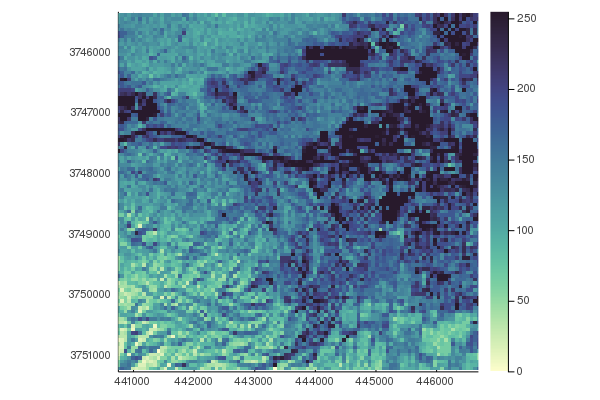

[](https://evetion.github.io/GeoArrays.jl/) [](https://travis-ci.org/evetion/GeoArrays.jl) [](https://ci.appveyor.com/project/evetion/GeoArrays-jl) [](https://codecov.io/gh/evetion/GeoArrays.jl)
# GeoArrays
Simple geographical raster interaction built on top of [ArchGDAL](https://github.com/yeesian/ArchGDAL.jl/), [GDAL](https://github.com/JuliaGeo/GDAL.jl) and [CoordinateTransformations](https://github.com/FugroRoames/CoordinateTransformations.jl).

A GeoArray is an AbstractArray, an AffineMap for calculating coordinates based on the axes and a CRS definition to interpret these coordinates into in the real world.

*this is a work in progress*

## Installation
```
(v1.2) pkg> add GeoArrays
```

## Examples

##### Read raster
```julia
using GeoArrays

fn = joinpath(dirname(pathof(GeoArrays)), "..", "test/data/utmsmall.tif")
geoarray = GeoArrays.read(fn)
100×100×1 GeoArray{UInt8}:
[:, :, 1] =
 0x6b  0x73  0x73  0x94  0x84  0xbd  0xc5  0x94  0x7b  0x8c  0x84  0x7b
 ...
```

##### CRS
```julia
geoarray.crs
"PROJCS[\"NAD27 / UTM zone 11N\",GEOGCS[\"NAD27\",DATUM[\"North_American_Datum_1927\",SPHEROID[\"Clarke 1866\",6378206.4,294.9786982138982,AUTHORITY[\"EPSG\",\"7008\"]],AUTHORITY[\"EPSG\",\"6267\"]],PRIMEM[\"Greenwich\",0],UNIT[\"degree\",0.0174532925199433],AUTHORITY[\"EPSG\",\"4267\"]],PROJECTION[\"Transverse_Mercator\"],PARAMETER[\"latitude_of_origin\",0],PARAMETER[\"central_meridian\",-117],PARAMETER[\"scale_factor\",0.9996],PARAMETER[\"false_easting\",500000],PARAMETER[\"false_northing\",0],UNIT[\"metre\",1,AUTHORITY[\"EPSG\",\"9001\"]],AUTHORITY[\"EPSG\",\"26711\"]]"
```

##### Coordinate transformations
```julia
geoarray.f
AffineMap([60.0 0.0; 0.0 -60.0], [440720.0, 3.75132e6])

# Find coordinates by index
coords(geoarray, [1,1])
2-element StaticArrays.SArray{Tuple{2},Float64,1,2}:
 440720.0
      3.75132e6

# Find index by coordinates
indices(geoarray, [440720.0, 3.75132e6])
2-element StaticArrays.SArray{Tuple{2},Int64,1,2}:
 1
 1

# Find all coordinates
coords(geoarray)
101×101 Array{StaticArrays.SArray{Tuple{2},Float64,1,2},2}:
 [440720.0, 3.75132e6]  [440720.0, 3.75126e6]  [440720.0, 3.7512e6] ...
 ...

# Move raster by x + 100
trans = Translation(100, 0)
compose!(geoarray, trans)
```

##### Plot the image
```julia
using Plots
plot(geoarray)
```


##### Table conversion
```julia
using DataFrames
DataFrame(geoarray)
10000×3 DataFrame
│ Row   │ x        │ y         │ bands  │
│       │ Float64  │ Float64   │ Array… │
├───────┼──────────┼───────────┼────────┤
│ 1     │ 440720.0 │ 3.75132e6 │ [0x6b] │
│ 2     │ 440780.0 │ 3.75132e6 │ [0x7b] │
│ 3     │ 440840.0 │ 3.75132e6 │ [0x84] │
│ 4     │ 440900.0 │ 3.75132e6 │ [0x73] │
│ 5     │ 440960.0 │ 3.75132e6 │ [0x84] │
│ 6     │ 441020.0 │ 3.75132e6 │ [0x84] │
│ 7     │ 441080.0 │ 3.75132e6 │ [0x8c] │
│ 8     │ 441140.0 │ 3.75132e6 │ [0x84] │
...
```

##### Write support
```julia
geoarray = GeoArray(rand(100,200,3))
GeoArrays.write!("test.tif", geoarray)
```
