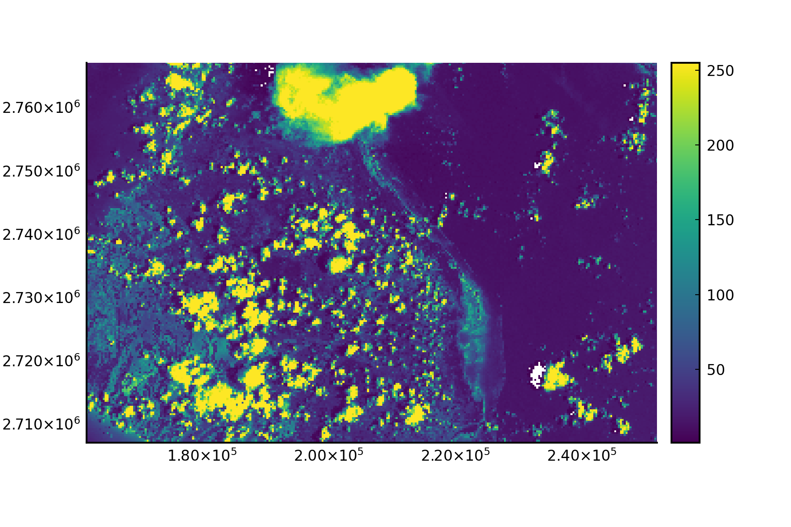

```@meta
CurrentModule = GeoArrays
```
[](https://evetion.github.io/GeoArrays.jl/dev) [](https://evetion.github.io/GeoArrays.jl/stable) [](https://github.com/evetion/GeoArrays.jl/actions/workflows/CI.yml) [](https://codecov.io/gh/evetion/GeoArrays.jl)

# GeoArrays

Simple geographical raster interaction built on top of [ArchGDAL](https://github.com/yeesian/ArchGDAL.jl/), [GDAL](https://github.com/JuliaGeo/GDAL.jl) and [CoordinateTransformations](https://github.com/FugroRoames/CoordinateTransformations.jl).

A GeoArray is an AbstractArray, an AffineMap for calculating coordinates based on the axes and a CRS definition to interpret these coordinates into in the real world. It's three dimensional and can be seen as a stack (3D) of 2D geospatial rasters (bands), the dimensions are :x, :y, and :bands. The AffineMap and CRS (coordinates) only operate on the :x and :y dimensions.

This packages takes its inspiration from Python's [rasterio](https://github.com/mapbox/rasterio).

## Installation

```julia
(v1.8) pkg> add GeoArrays
```

## Examples

### Basic Usage

Load the `GeoArrays` package.

```julia
julia> using GeoArrays
```

Read a GeoTIFF file and display its information, i.e. AffineMap and projection (CRS).

```julia
# Read TIF file
julia> fn = download("https://github.com/yeesian/ArchGDALDatasets/blob/master/data/utmsmall.tif?raw=true")
julia> geoarray = GeoArrays.read(fn)
100x100x1 Array{UInt8,3} with AffineMap([60.0 0.0; 0.0 -60.0], [440720.0, 3.75132e6]) and CRS PROJCS["NAD27 / UTM zone 11N"...

# Affinemap containing offset and scaling
julia> geoarray.f
AffineMap([60.0 0.0; 0.0 -60.0], [440720.0, 3.75132e6])

# WKT projection string
julia> geoarray.crs
GeoFormatTypes.WellKnownText{GeoFormatTypes.CRS}(GeoFormatTypes.CRS(), "PROJCS[\"NAD27 / UTM zone 11N\",GEOGCS[\"NAD27\",DATUM[\"North_American_Datum_1927\",SPHEROID[\"Clarke 1866\",6378206.4,294.978698213898,AUTHORITY[\"EPSG\",\"7008\"]],AUTHORITY[\"EPSG\",\"6267\"]],PRIMEM[\"Greenwich\",0],UNIT[\"degree\",0.0174532925199433,AUTHORITY[\"EPSG\",\"9122\"]],AUTHORITY[\"EPSG\",\"4267\"]],PROJECTION[\"Transverse_Mercator\"],PARAMETER[\"latitude_of_origin\",0],PARAMETER[\"central_meridian\",-117],PARAMETER[\"scale_factor\",0.9996],PARAMETER[\"false_easting\",500000],PARAMETER[\"false_northing\",0],UNIT[\"metre\",1,AUTHORITY[\"EPSG\",\"9001\"]],AXIS[\"Easting\",EAST],AXIS[\"Northing\",NORTH],AUTHORITY[\"EPSG\",\"26711\"]]")
```

### Writing to GeoTIFF
Create a random `GeoArray` and write it to a GeoTIFF file.

```julia
# Create, reference and write a TIFF
julia> ga = GeoArray(rand(100,200))
julia> bbox!(ga, (min_x=2., min_y=51., max_x=5., max_y=54.))  # roughly the Netherlands
julia> epsg!(ga, 4326)  # in WGS84
julia> GeoArrays.write("test.tif", ga)
# Or write it with compression and tiling
julia> GeoArrays.write("test_compressed.tif", ga; options=Dict("TILED"=>"YES", "COMPRESS"=>"ZSTD"))
```

### Streaming support
The package supports streaming reading.

```julia
# Read in 39774x60559x1 raster (AHN3), but without masking (missing) support
julia> @time ga = GeoArrays.read(fn, masked=false)
  0.001917 seconds (46 allocations: 2.938 KiB)
39774x60559x1 ArchGDAL.RasterDataset{Float32,ArchGDAL.IDataset} with AffineMap([1.0433425614165472e-6 0.0; 0.0 -1.0433425614165472e-6], [0.8932098305563291, 0.11903776654646055]) and CRS PROJCS["Amersfoort / RD New",GEOGCS["Amersfoort",DATUM["Amersfoort",SPHEROID["Bessel 1841",6377397.155,299.1528128,AUTHORITY["EPSG","7004"]],AUTHORITY["EPSG","6289"]],PRIMEM["Greenwich",0,AUTHORITY["EPSG","8901"]],UNIT["degree",0.0174532925199433,AUTHORITY["EPSG","9122"]],AUTHORITY["EPSG","4289"]],PROJECTION["Oblique_Stereographic"],PARAMETER["latitude_of_origin",52.1561605555556],PARAMETER["central_meridian",5.38763888888889],PARAMETER["scale_factor",0.9999079],PARAMETER["false_easting",155000],PARAMETER["false_northing",463000],UNIT["metre",1,AUTHORITY["EPSG","9001"]],AXIS["Easting",EAST],AXIS["Northing",NORTH],AUTHORITY["EPSG","28992"]]
```

### Reading bands
GeoTIFFs can be large, with several bands, one can read.

When working with large rasters, e.g. with satellite images that can be GB in size, it is useful to be able to read only one band (or a selection of them) to `GeoArray`. When using `read`, one can specify the band.

```julia
# Get file
julia> fn = download("https://github.com/yeesian/ArchGDALDatasets/blob/master/pyrasterio/RGB.byte.tif?raw=true")

# Read band 2
julia> ga_band = GeoArrays.read(fn, masked=false, band=2)
791x718x1 Array{UInt8, 3} with AffineMap([300.0379266750948 0.0; 0.0 -300.041782729805], [101985.0, 2.826915e6]) and CRS PROJCS["UTM Zone 18, Northern Hemisphere",GEOGCS["Unknown datum based upon the WGS 84 ellipsoid",DATUM["Not_specified_based_on_WGS_84_spheroid",SPHEROID["WGS 84",6378137,298.257223563,AUTHORITY["EPSG","7030"]]],PRIMEM["Greenwich",0],UNIT["degree",0.0174532925199433,AUTHORITY["EPSG","9122"]]],PROJECTION["Transverse_Mercator"],PARAMETER["latitude_of_origin",0],PARAMETER["central_meridian",-75],PARAMETER["scale_factor",0.9996],PARAMETER["false_easting",500000],PARAMETER["false_northing",0],UNIT["metre",1,AUTHORITY["EPSG","9001"]],AXIS["Easting",EAST],AXIS["Northing",NORTH]]
```

In case there is missing data, the type will be a `Union{Missing, T}`. To convert to a GeoArray without `missing`, you can call `coalesce(ga, value_to_replace_missing)`.

### Using coordinates
`GeoArray`s have geographical coordinates for all array elements (pixels). They can be retrieved with the `GeoArrays.coords` function.

```julia
# Find coordinates by index
julia> GeoArrays.coords(geoarray, (1,1))
2-element StaticArrays.SArray{Tuple{2},Float64,1,2}:
 440720.0
      3.75132e6
```

All coordinates (tuples) are obtained as generator when omitting the index parameter.

```julia
# Find all coordinates
julia> collect(GeoArrays.coords(geoarray))
101×101 Matrix{StaticArraysCore.SVector{2, Float64}}:
 [440720.0, 3.75132e6]  [440720.0, 3.75126e6]  [440720.0, 3.7512e6] ...
 ...
```

Similarly, one can find the coordinates ranges of a GeoArray

```julia
julia> x, y = GeoArrays.ranges(geoarray)
(440750.0:60.0:446690.0, 3.75129e6:-60.0:3.74535e6)
```

The operation can be reversed, i.e. row and column index can be computed from coordinates with the `indices` function.

```julia
# Find index by coordinates
julia> indices(geoarray, [440720.0, 3.75132e6])
CartesianIndex(1, 1)
```

### Manipulation
Basic `GeoArray` manipulation is implemented, e.g. translation.
```julia
# Translate complete raster by x + 100
julia> trans = Translation(100, 0)
julia> compose!(ga, trans)
```

When GeoArrays have the same dimensions, AffineMap and CRS, addition, subtraction, multiplication and division can be used.

```julia
# Math with GeoArrays (- + * /)
julia> GeoArray(rand(5,5,1)) - GeoArray(rand(5,5,1))
5x5x1 Array{Float64,3} with AffineMap([1.0 0.0; 0.0 1.0], [0.0, 0.0]) and undefined CRS
```

One can also warp an array, using GDAL behind the scenes.
For example, we can vertically transform from the ellipsoid
to the EGM2008 geoid using EPSG code 3855.
Note that the underlying PROJ library needs to find the geoidgrids,
so if they're not available locally, one needs to set `ENV["PROJ_NETWORK"] = "ON"`
as early as possible, ideally before loading GeoArrays.
```julia
ga = GeoArray(zeros((360, 180)))
bbox!(ga, (min_x=-180, min_y=-90, max_x=180, max_y=90))
crs!(ga, GeoFormatTypes.EPSG(4979))  # WGS83 in 3D (reference to ellipsoid)
ga2 = GeoArrays.warp(ga, Dict("t_srs" => "EPSG:4326+3855"))
```

### Nodata filling
GeoArrays with missing data can be filled with the [`fill!`](@ref) function.

```julia
julia> using GeoStatsSolvers  # or any estimation solver from the GeoStats ecosystem
julia> ga = GeoArray(Array{Union{Missing, Float64}}(rand(5, 1)))
julia> ga.A[2,1] = missing
[:, :, 1] =
 0.6760718768442127
  missing
 0.852882193026649
 0.7137410453351622
 0.5949409082233854
julia> GeoArrays.fill!(ga, IDW(:band => (neighbors=3,)))  # band is the hardcoded variable
[:, :, 1] =
 0.6760718768442127
 0.7543298370153771
 0.852882193026649
 0.7137410453351622
 0.5949409082233854
```

### Plotting
Individual bands from a GeoArray can be plotted with the `plot` function. By default the first band is used.

```julia
# Plot a GeoArray
julia> using Plots
julia> fn = download("https://github.com/yeesian/ArchGDALDatasets/blob/master/pyrasterio/RGB.byte.tif?raw=true")
julia> ga = GeoArrays.read(fn)
julia> plot(ga)

# or plot a band other than the first one
julia> plot(ga, band=2)
```


Note that for larger GeoArrays, only a sample of the data is plotted for performance.
By default the sample size is twice figure size. You can control this factor by calling `plot(ga, scalefactor=2)`,
where higher scalefactor yields higher sizes, up to the original GeoArray size.

### Subsetting arrays
GeoArrays can be subset by row, column and band using the array subsetting notation, e.g. `ga[100:200, 200:300, 1:2]`.

```julia
# Get file
julia> fn = download("https://github.com/yeesian/ArchGDALDatasets/blob/master/pyrasterio/RGB.byte.tif?raw=true")

# Read the entire file
julia> ga = GeoArrays.read(fn);

julia> ga.f
AffineMap([300.0379266750948 0.0; 0.0 -300.041782729805], [101985.0, 2.826915e6])

julia> ga_sub = ga[200:500,200:400,begin:end]
301x201x3 Array{Union{Missing, UInt8}, 3} with AffineMap([300.0379266750948 0.0; 0.0 -300.041782729805], [161692.54740834387, 2.767206685236769e6]) and CRS PROJCS["UTM Zone 18, Northern Hemisphere",GEOGCS["Unknown datum based upon the WGS 84 ellipsoid",DATUM["Not_specified_based_on_WGS_84_spheroid",SPHEROID["WGS 84",6378137,298.257223563,AUTHORITY["EPSG","7030"]]],PRIMEM["Greenwich",0],UNIT["degree",0.0174532925199433,AUTHORITY["EPSG","9122"]]],PROJECTION["Transverse_Mercator"],PARAMETER["latitude_of_origin",0],PARAMETER["central_meridian",-75],PARAMETER["scale_factor",0.9996],PARAMETER["false_easting",500000],PARAMETER["false_northing",0],UNIT["metre",1,AUTHORITY["EPSG","9001"]],AXIS["Easting",EAST],AXIS["Northing",NORTH]]

julia> ga_sub.f
AffineMap([300.0379266750948 0.0; 0.0 -300.041782729805], [161692.54740834387, 2.767206685236769e6])

julia> plot(ga_sub)
```


### Profile
You can sample the values along a line in a GeoArray with `profile(ga, linestring)`. The linestring can be any geometry that supports [GeoInterface.jl](https://github.com/JuliaGeo/GeoInterface.jl/).


## Alternatives
GeoArrays.jl was written to quickly save a geospatial Array to disk. Its functionality mimics `rasterio` in Python. If one requires more features---such as rasterization or zonal stats---which also work on NetCDF files, [Rasters.jl](https://github.com/rafaqz/Rasters.jl/) is a good alternative. Its functionality is more like `(rio)xarray` in Python.

## Index
```@index
```
